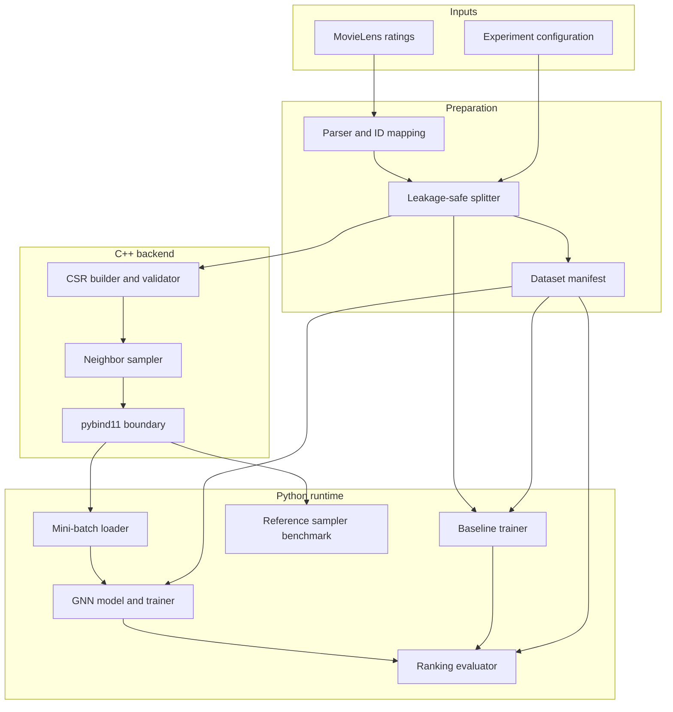

# Architecture

## Component model

## Data contracts

### Interaction record

The logical prepared record contains:

| Field | Meaning |
| --- | --- |
| `user_id` | Contiguous zero-based user index |
| `movie_id` | Contiguous zero-based movie index within movie type |
| `rating` | Original explicit rating retained for provenance/filtering |
| `timestamp` | Original interaction time used by chronological splitting |
| `split` | Train, validation, or test assignment |

The global graph node ID for a movie is `num_users + movie_id`; a user global ID
is `user_id`. The training CSR contains only training-positive interactions and
stores each as two adjacency entries.

### CSR graph

- `offsets` length is `num_nodes + 1`.
- `offsets[0] == 0` and offsets are nondecreasing.
- `offsets[-1] == len(neighbors)`.
- Every neighbor lies in `[0, num_nodes)` and has the opposite bipartite type.
- Duplicate edges have a documented policy; proposed default is deduplication.
- Neighbor ordering is deterministic after graph construction.

The Phase 1 `sagerec::BipartiteCSR` implementation uses that proposed default:
typed `(user_id, movie_id)` interactions are stored as two directed adjacency
entries, duplicates are dropped, and each neighborhood is sorted by ascending
global node ID. Self-edges cannot be expressed because construction accepts only
user-movie pairs with disjoint global ranges. The graph does not ingest
MovieLens files and does not know about splits; callers must pass training
positives only.

### MovieLens 100K parser

`sagerec::parse_movielens_100k` accepts in-memory tab-separated `u.data` text
(source user id, movie id, rating, timestamp). It is a separate unit from CSR
construction:

- Source IDs must be positive integers. Local user and movie IDs are the ranks
  of those source IDs among the sorted unique IDs of each type.
- Rating and timestamp are preserved on each normalized interaction.
- Interaction order follows the non-blank input rows. Whitespace-only lines are
  skipped. CRLF endings are accepted.
- No split field is assigned here. ADR-003 leave-one-out runs in Python
  (`sagerec_prep.split_interactions`) on these normalized rows. The parser
  never downloads data, reads a filesystem path, or parses MovieLens 1M.
  Phase 2 path ingestion lives in `python/sagerec_dataset.py` and feeds
  file or byte contents into this in-memory parser.
- `local_pairs()` yields the `(user_id, movie_id)` vector that
  `BipartiteCSR::from_interactions` already accepts. Callers must still restrict
  that list to training positives before building a sampling graph.

Invalid input throws `GraphError` with the 1-based row number and the expected
constraint: empty input, wrong field count, non-integer fields, integer overflow,
nonpositive source IDs, or a duplicate source user-movie pair.

### Leave-one-out split (ADR-003)

`python/sagerec_prep.py` assigns splits in memory to already-normalized
interactions (parser structs or equivalent). It does not remap IDs, read
paths, or download data. Phase 2 on-disk prep (`python/sagerec_dataset.py`)
reuses this function and writes `data/processed/` artifacts:

- Eligible users have at least three interactions. After sorting each user's
  rows by `(timestamp, user_id, movie_id)` ascending, the last row is test,
  the second-last is validation, and earlier rows are train.
- Users with fewer than three interactions are cold-start: every row is train,
  and the user is omitted from validation/test ranking eligibility.
- Local IDs preserve source-ID order from the parser, so the tie-break matches
  `(timestamp, source_user_id, source_movie_id)`. Duplicate local pairs fail.
- `train_positive_pairs()` is the only edge list that may enter
  `BipartiteCSR`. Held-out positives must not appear in that set.
- `build_manifest()` records edition `100k`, policy id/version, eligibility
  and cold-start defaults, per-split counts, `seed: null`, and source URL /
  checksum / license when the caller supplies them. On-disk prep fills those
  provenance fields. The schema is `data/processed/manifest.schema.json`.

### MovieLens 100K download and on-disk prep

`python/sagerec_download.py` fetches the official GroupLens 100K zip
(`https://files.grouplens.org/datasets/movielens/ml-100k.zip`), verifies the
published archive MD5 `0e33842e24a9c977be4e0107933c0723` when that default URL
is used, and extracts `u.data` under a caller-supplied `data/raw/` directory.
MovieLens 1M URLs are rejected. If TLS verification fails against an expired
GroupLens certificate, a second attempt without TLS verification is allowed
only when an expected archive MD5 will still be checked.

`python/sagerec_dataset.py` reads `u.data` from a path or bytes, calls
`graph_sampler.parse_movielens_100k` and `sagerec_prep.split_interactions`,
asserts that train pairs are disjoint from held-out positives, and writes
`assignments.jsonl`, `train_pairs.json`, `mappings.json`, and a filled
`manifest.json` under `data/processed/`. Those generated files are gitignored;
the schema stays tracked.

The same in-memory parser is bound on `graph_sampler` as `parse_movielens_100k`,
returning `MovieLens100kRatings` (`num_users`, `num_movies`, `interactions`,
`user_source_ids`, `movie_source_ids`, `local_pairs()`). Callers still pass
training positives only into `BipartiteCSR`. The binding copies Python text into
owned C++ storage before releasing the GIL.

### Sampling API

The intended Python-facing abstraction is conceptually:

`sample_neighbors(node_id, k, seed) -> sequence[node_id]`

`python/sagerec_minibatch.py` adds the batch/multi-hop variant used by the
Phase 4 training-data path. The accepted contract must state replacement
behavior, output ordering, deterministic seed semantics, invalid-node
behavior, and concurrency guarantees.

ADR-005 accepts uniform sampling without replacement, the full neighborhood when
`k >= degree`, and empty results for isolated nodes or `k = 0`. Phase 1
implemented that contract; changing replacement requires a superseding ADR. The
naive Python reference in `python/sagerec_reference_sampler.py` consumes CSR
`offsets`/`neighbors` views and implements the same contract, including the
native Fisher–Yates prefix, `std::mt19937_64` seed, and unbiased
`uniform_below` draw.

The Phase 4 harness (`python/sagerec_minibatch.py`) builds a train-only
`BipartiteCSR` from local pairs and expands seeded multi-hop neighborhoods by
calling native `sample_neighbors`. GraphSAGE training (`python/sagerec_graphsage.py`)
consumes those batches; the helper itself does not own layers or metrics.
Current one-hop behavior:

| Topic | Implementation contract |
| --- | --- |
| Replacement | Uniform without replacement |
| `k == 0` or degree `0` | Empty sequence |
| `k >= degree` | Full stored neighborhood, CSR order (ascending global IDs) |
| `0 < k < degree` | `k` unique neighbors; order is Fisher–Yates prefix order |
| Seed | Explicit; the same `(graph, node_id, k, seed)` tuple is reproducible |
| Invalid `node_id` or `k < 0` or `seed < 0` | Fail with an actionable `GraphError` |
| Concurrency | Sampling is `const` and uses a per-call engine; no shared RNG |

## Mini-batch neighborhood helper (Phase 4 harness)

`python/sagerec_minibatch.py` is the Python training-data path into the native
sampler. Public surface:

- `load_graph_sampler()` imports the compiled `graph_sampler` extension or
  fails with an actionable error (missing module, non-`.so` stub).
- `train_csr_from_pairs(num_users, num_movies, train_pairs)` constructs a
  train-only `BipartiteCSR`. Callers must pass training positives only.
- `NativeMinibatchSampler.from_train_pairs(...)` / `from_graph(csr)` wrap
  that graph. Non-native objects are rejected.
- `sample_neighbors(node_id, k, seed)` delegates to
  `call_native_sample_neighbors`, the single call site for
  `graph_sampler.BipartiteCSR.sample_neighbors` (seed unchanged).
- `sample_multihop(seed_nodes, fanouts, seed)` expands GraphSAGE-style
  frontiers. Hop 0 sources are `seed_nodes`; hop `h+1` sources are the
  concatenation of hop `h` neighbor lists. Each native call uses
  `derived_sample_seed(seed, hop, source_index)` (hash-seed independent).

The helper must not fall back to `sagerec_reference_sampler` or a PyG
neighbor sampler. GraphSAGE training converts native `NeighborhoodBatch`
data into PyTorch tensors for in-repo mean aggregation. It does not use a
PyG NeighborLoader.

## Training flow

1. Load a versioned dataset manifest and train-only CSR graph.
2. Select positive user-movie training edges for a mini-batch.
3. Generate valid negative pairs while excluding known positives.
4. Expand required neighborhoods through the native sampler
   (`sagerec_minibatch.NativeMinibatchSampler`).
5. Convert sampled neighborhoods into PyTorch tensors (not PyG
   `NeighborLoader` / `SAGEConv` in this slice).
6. Compute positive and negative recommendation scores with GraphSAGE
   mean aggregation and optimize logistic ranking loss
   (`python/sagerec_graphsage.py`).
7. Evaluate checkpoints with the fixed ranking protocol via
   `PairScorer` + `sagerec_metrics.evaluate_ranking`. Tiny synthetic
   metrics are protocol smoke, not a MovieLens 100K result.

The GNN family is GraphSAGE (ADR-002). PyTorch Geometric remains the
intended production training stack; this slice trains with CPU PyTorch
on native samples.

## Baseline (ADR-004)

Phase 3 implements implicit-feedback matrix factorization, not node2vec.
`python/sagerec_baseline.py` fits user and item factors with logistic SGD
on training positives plus uniform negatives. It consumes
`SplitResult.train_positive_pairs()` only. Held-out positives must not
enter that edge set or a train-only `BipartiteCSR` built from it.

Configuration is explicit: factor count, epochs, learning rate, L2,
negatives per positive, and seed. NumPy is the v1 numeric dependency;
do not add node2vec or extra ML libraries for this slice.

## Scoring interface

Models implement `sagerec_scoring.PairScorer.score_pairs(user_ids, item_ids)`
and return one higher-is-better score per aligned pair. The baseline
(`ImplicitMF`) and GraphSAGE (`GraphSAGERecommender`) satisfy that
protocol so the evaluator stays model-agnostic.

## Evaluation boundary

Evaluation owns candidate filtering, ranking, and metric aggregation
(`python/sagerec_metrics.py`). Models expose scores or embeddings but must
not implement model-specific metric logic. This keeps GNN/baseline
comparisons identical.

The shared protocol for this slice:

- Eligible users only (ADR-003: at least three interactions). Cold-start
  users are omitted from ranking.
- One held-out positive per eligible user on the target split
  (validation or test).
- Candidates are every movie in `[0, num_movies)` except that user's
  training positives, and except validation positives when the target
  split is test. The evaluation positive stays in the candidate set.
- Rank by score descending; ties break on smaller `movie_id`.
- Report Recall@10 and NDCG@10 per user, then macro-average.
- Tiny synthetic unittest metrics are protocol verification, not a
  MovieLens 100K quality claim.

## Benchmark boundary

The native and reference samplers consume the same query workload and satisfy the
same output properties. The reference sampler and synthetic-graph parity tests
exist; timed workloads, stored benchmark numbers, and charts do not. Workload
generation occurs outside timed regions. Release native builds are mandatory for
published timing.

## Dependency direction

The native graph core must not depend on Python, PyTorch, or PyTorch Geometric.
Bindings depend on the native core. Python orchestration may depend on bindings,
but model and evaluation logic should use a narrow sampler interface so tests can
substitute a deterministic fake.
