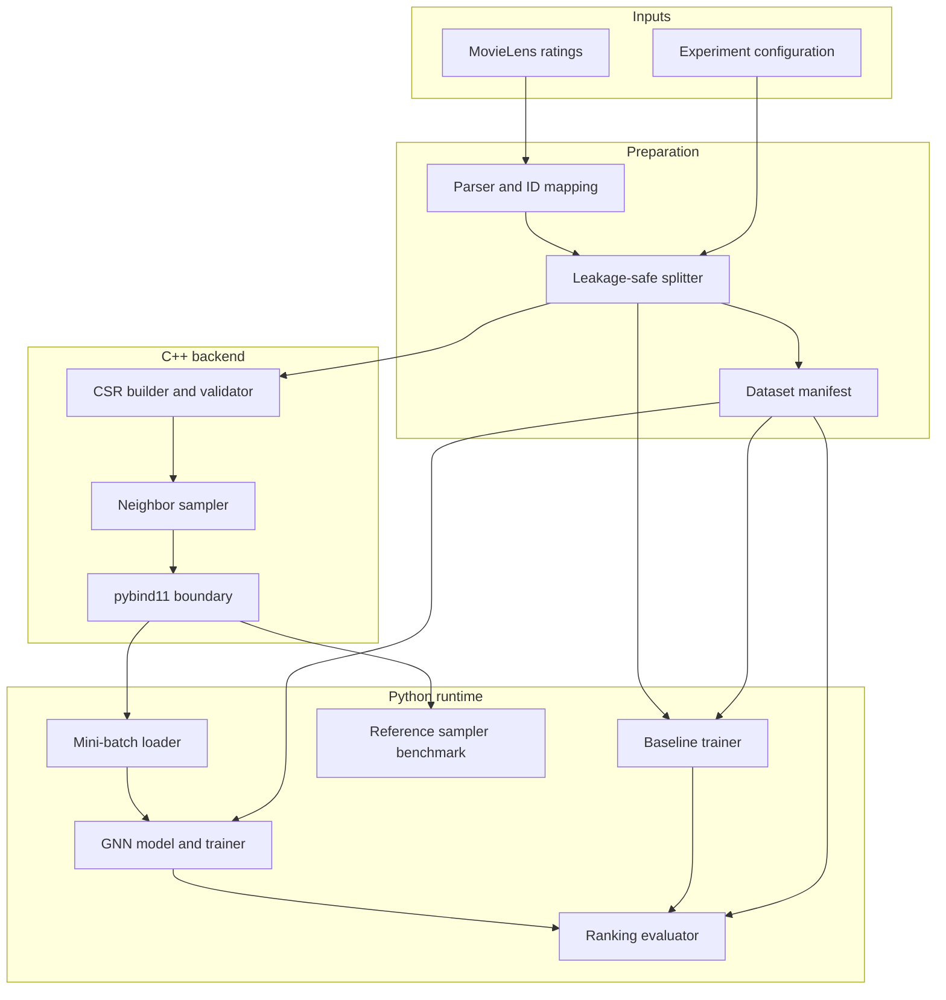

# Architecture

## Component model

## Data contracts

### Interaction record

The logical prepared record contains:

| Field | Meaning |
| --- | --- |
| `user_id` | Contiguous zero-based user index |
| `movie_id` | Contiguous zero-based movie index within movie type |
| `rating` | Original explicit rating retained for provenance/filtering |
| `timestamp` | Original interaction time used by chronological splitting |
| `split` | Train, validation, or test assignment |

The global graph node ID for a movie is `num_users + movie_id`; a user global ID
is `user_id`. The training CSR contains only training-positive interactions and
stores each as two adjacency entries.

### CSR graph

- `offsets` length is `num_nodes + 1`.
- `offsets[0] == 0` and offsets are nondecreasing.
- `offsets[-1] == len(neighbors)`.
- Every neighbor lies in `[0, num_nodes)` and has the opposite bipartite type.
- Duplicate edges have a documented policy; proposed default is deduplication.
- Neighbor ordering is deterministic after graph construction.

The Phase 1 `sagerec::BipartiteCSR` implementation uses that proposed default:
typed `(user_id, movie_id)` interactions are stored as two directed adjacency
entries, duplicates are dropped, and each neighborhood is sorted by ascending
global node ID. Self-edges cannot be expressed because construction accepts only
user-movie pairs with disjoint global ranges. The graph does not ingest
MovieLens files and does not know about splits; callers must pass training
positives only.

### Sampling API

The intended Python-facing abstraction is conceptually:

`sample_neighbors(node_id, k, seed) -> sequence[node_id]`

Batch and multi-hop variants may be added after the minimal API is correct. The
accepted contract must state replacement behavior, output ordering, deterministic
seed semantics, invalid-node behavior, and concurrency guarantees. Proposed
default: uniform sampling without replacement, return the full neighborhood when
`k >= degree`, and return empty for isolated nodes or `k = 0`.

Phase 1 implements those proposed ADR-005 defaults as the current
`graph_sampler` contract. ADR-005 remains a proposal. Current behavior:

| Topic | Implementation contract |
| --- | --- |
| Replacement | Uniform without replacement |
| `k == 0` or degree `0` | Empty sequence |
| `k >= degree` | Full stored neighborhood, CSR order (ascending global IDs) |
| `0 < k < degree` | `k` unique neighbors; order is Fisher–Yates prefix order |
| Seed | Explicit; the same `(graph, node_id, k, seed)` tuple is reproducible |
| Invalid `node_id` or `k < 0` or `seed < 0` | Fail with an actionable `GraphError` |
| Concurrency | Sampling is `const` and uses a per-call engine; no shared RNG |

## Training flow

1. Load a versioned dataset manifest and train-only CSR graph.
2. Select positive user-movie training edges for a mini-batch.
3. Generate valid negative pairs while excluding known positives.
4. Expand required neighborhoods through the native sampler.
5. Convert sampled subgraph data into PyTorch Geometric tensors.
6. Compute positive and negative recommendation scores and optimize ranking loss.
7. Evaluate checkpoints with the fixed ranking protocol.

The GNN family is GraphSAGE (ADR-002). Layer implementation remains Phase 4.

## Evaluation boundary

Evaluation owns candidate filtering, scoring, ranking, and metric aggregation.
Models expose scores or embeddings but must not implement model-specific metric
logic. This keeps GNN/baseline comparisons identical.

## Benchmark boundary

The native and reference samplers consume the same query workload and satisfy the
same output properties. Workload generation occurs outside timed regions. Release
native builds are mandatory for published timing.

## Dependency direction

The native graph core must not depend on Python, PyTorch, or PyTorch Geometric.
Bindings depend on the native core. Python orchestration may depend on bindings,
but model and evaluation logic should use a narrow sampler interface so tests can
substitute a deterministic fake.
